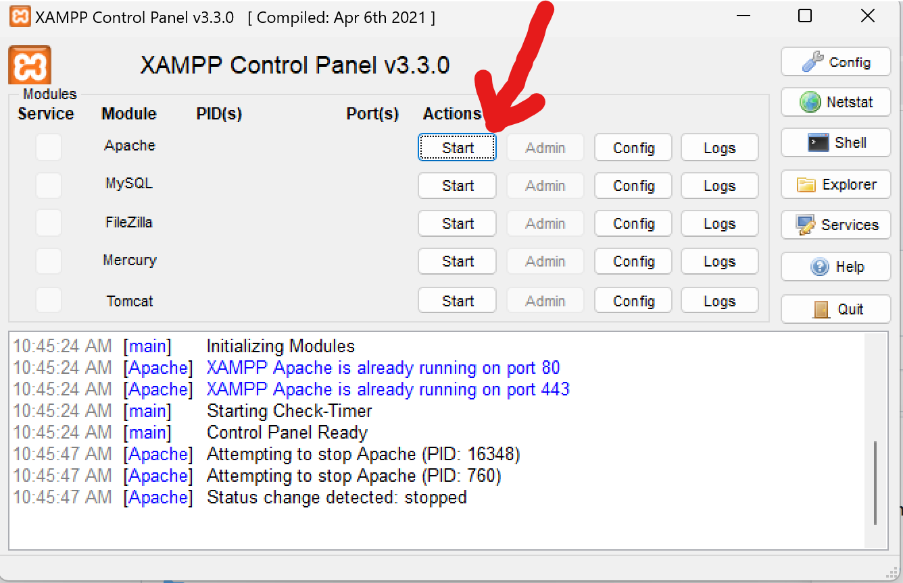
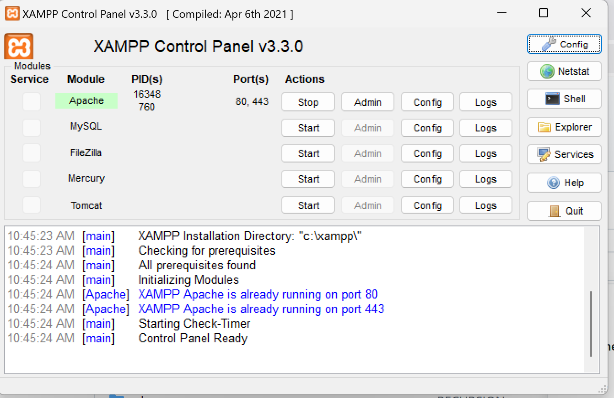
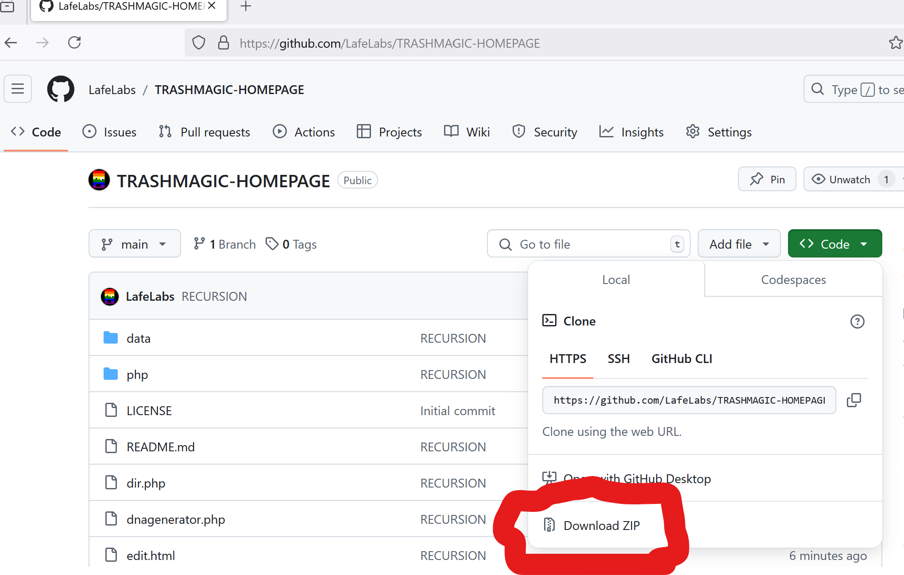
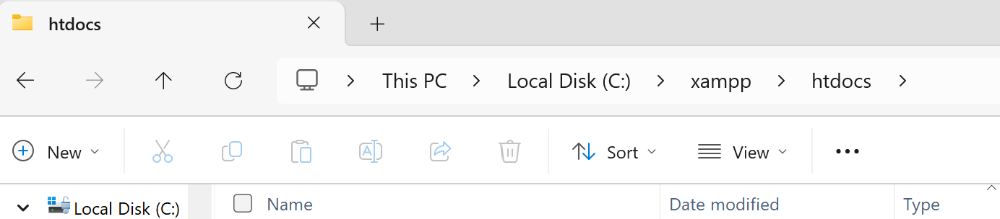
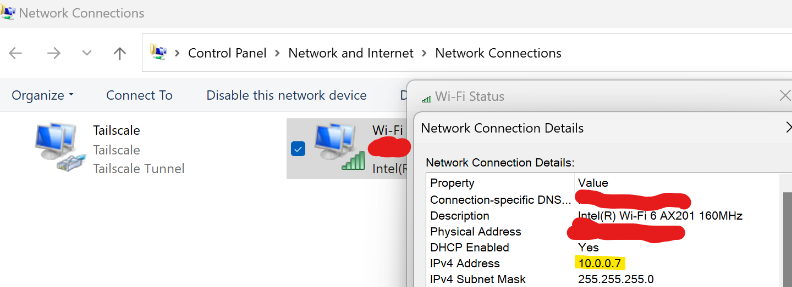

# [TRASHMAGIC-HOMEPAGE](https://github.com/LafeLabs/TRASHMAGIC-HOMEPAGE)

TRASH MAGIC HOME PAGE

1. **INSTALL  XAMPP ON YOUR COMPUTER**.  GO TO [www.apachefriends.org/](https://www.apachefriends.org/) AND DOWNLOAD THE VERSION OF XAMPP FOR YOUR MACHINE AND INSTALL IT! START THE XAMPP SERVER!
2. FIND THE FOLDER c:\\xampp\htdocs AND DELETE index.html!
3. DOWNLOAD THE ZIP OF THIS REPOSITORY AND UNZIP IT INTO THE c:\\xampp\htdocs FOLDER!
4. START THE XAMPP SERVER AND GO TO THE PAGE AT [http://localhost/](http://localhost/)
5. TO SHARE THIS HOME PAGE FIND YOUR IP ADDRESS ON YOUR LOCAL WIFI AND SHARE THE LINK TO http://[your ip address] WITH PEOPLE IN YOUR COMMUNITY ON YOUR WIFI!
6. BUILD FORKS FOR CONTENT! SHARE CONTENT! MAKE MORE SERVERS! REPLICATE THE SERVERS!
7. POINT PUBLIC FACING TRASH MAGIC WEB PAGES TO A PHYSICAL SPACE WITH SHARED MEDIA!
8. POINT PHYSICAL MEDIA TO THE PUBLIC FACING WEB PAGE AND DISTRIBUTE PHYSICAL MEDIA IN HIGH TRAFFIC AREAS NEAR PHYSICAL SHARING SPACES!

## DOWNLOAD THE SOFTWARE AND INSTALL IT!

## START THE SERVER!

## THIS IS WHAT IT LOOKS LIKE WHEN IT'S RUNNING!

## DOWNLOAD THE ZIP FILE OF THIS FILE REPOSITORY!

## THE FILE PATH IS c:\\xampp\htdocs\ ON WINDOWS, PROBABLY SOMETHING SIMILAR ON MAC

## FIND YOUR IP ADDRESS TO SHARE IT

